# OperantKit

:gb: [English README](README.md)

行動研究のためのオペラント条件づけツールキット。

---

## パイプライン

DSL で強化随伴性を宣言し、仮想ハードウェアまたは実機で実行し、すべてのイベントを OKL として記録し、セッションを解析する — 各ステージは独立したパッケージとして提供される。

```mermaid
flowchart LR
    SW[schedule-writer]:::tools --> DSL[contingency-dsl]:::core
    DSL --> ENG[contingency-py / contingency-rs]:::core
    ENG --> IO[experiment-io HAL]:::tools
    IO --> OKL[OperantKitLog]:::exp
    OKL --> REC[session-recorder]:::exp
    REC --> ANA[session-analyzer]:::analysis
    REC --> SVZ[session-visualizer]:::tools
    SVZ --> FE[operantkit-frontend]:::soft
    classDef core fill:#e3f2fd,stroke:#1565c0,color:#0d47a1
    classDef exp fill:#fff3e0,stroke:#e65100,color:#bf360c
    classDef tools fill:#e8f5e9,stroke:#2e7d32,color:#1b5e20
    classDef analysis fill:#f3e5f5,stroke:#6a1b9a,color:#4a148c
    classDef soft fill:#eceff1,stroke:#455a64,color:#263238
    click SW "https://github.com/OperantKit/schedule-writer"
    click DSL "https://github.com/OperantKit/contingency-dsl"
    click ENG "https://github.com/OperantKit/contingency-py"
    click IO "https://github.com/OperantKit/experiment-io"
    click OKL "https://github.com/OperantKit/OperantKitLog"
    click REC "https://github.com/OperantKit/session-recorder"
    click ANA "https://github.com/OperantKit/session-analyzer"
    click SVZ "https://github.com/OperantKit/session-visualizer"
    click FE "https://github.com/OperantKit/operantkit-frontend"
```



---

## ① 随伴性を書く — [contingency-dsl](https://github.com/OperantKit/contingency-dsl)

強化スケジュールと Pavlov 型手続きのための非チューリング完全 DSL。一行記述から多フェーズ CER プロトコルまで：

```
-- 原子スケジュール
FR5                              -- 固定比率 5
VI60s                            -- 変動間隔 60 秒
Conc(VI30s, VI60s)               -- 並立 VI30 vs. VI60

-- 条件性情動反応 (Estes & Skinner, 1941)
@cs(label="Tone", duration=60s, modality="auditory")
@us(label="Shock", intensity="0.5mA", delivery="unsignaled")

phase baseline:
  sessions = 10
  VI60s
phase pairing:
  sessions = 5
  Pair.ForwardDelay(Tone, Shock, isi=60s, cs_duration=60s)
phase test:
  sessions = 3
  use baseline
```

6 層構造（Foundations / Operant / Respondent / Composed / Experiment / Annotation）、150 件超の conformance fixture、EBNF + AST スキーマ。姉妹パッケージ [contingency-respondent-dsl](https://github.com/OperantKit/contingency-respondent-dsl) は高次条件づけ・阻止・条件性弁別・更新・再生に対応する。

著作支援ツール: [schedule-writer](https://github.com/OperantKit/schedule-writer) — ドロップダウン選択／ブロック・ドラッグで DSL テキストを生成する。

---

## ② 動かす — [contingency-py](https://github.com/OperantKit/contingency-py) · [contingency-rs](https://github.com/OperantKit/contingency-rs) · [experiment-io](https://github.com/OperantKit/experiment-io)

Python エンジンは Ferster–Skinner の全スケジュール（FR / VR / RR / FI / VI / RI / FT / VT / RT / CRF / EXT、Concurrent、Alternative、DRO / DRL / DRH、Progressive Ratio）を提供する。Rust エンジンは 14 件の決定論的 conformance fixture でビット等価性を確認済みで、PyO3 / WASM / C FFI / KMP バインディングを備える。

```python
from contingency import ScheduleBuilder
from experiment_core import ReinforcementCountExit
from experiment_io import drive
from experiment_io.hw.backends.virtual import (
    ManualClock, RecordingReinforcer, VirtualOperandum, VirtualSubject,
)
from session_runner import SessionConfig, SessionRunner

clock = ManualClock()
op = VirtualOperandum(0, VirtualSubject(rate_hz=5.0, seed=0), clock)
rein = RecordingReinforcer(operandum_index=0)
runner = SessionRunner(
    SessionConfig(name="demo", schedule=ScheduleBuilder.fr(1),
                  exit_condition=ReinforcementCountExit(count=3)),
    clock=clock,
)
runner.start(start_time=clock())
drive(runner, [op], [rein], clock, reinforcer_duration=0.2)
```

`virtual` を `serial` / `hil_bridge` に差し替えるだけで同じコードが実機オペラント箱を駆動する。タイミング精度は [contingency-bench](https://github.com/OperantKit/contingency-bench) で検証する。

---

## ③ OKL として記録する — [OperantKitLog](https://github.com/OperantKit/OperantKitLog) · [session-recorder](https://github.com/OperantKit/session-recorder)

OKL v1 は規範的かつ言語非依存なワイヤフォーマット。ヘッダは可読な TOML 風、ボディは 1 行 1 イベントの TSV。上記の `drive()` 呼び出しはそのままこのバイト列を書き出す：

```
# OKL v1
# session_name = "demo"
# clock_type = "ManualClock"
# subject_id = "subj01"
# experiment_name = "demo"
# events:
#   response          : id:int operandum:int?
#   reinforcer_start  : id:int potency:float operandum:int?
#   reinforcer_end    : id:int operandum:int?
#   state_change      : from:str to:str
#   phase_enter       : label:str name:str?
# ---
0.0    state_change       IDLE  RUNNING
0.0    phase_enter        Train A
0.5    response           0     0
1.0    response           1     0
1.5    response           2     0
1.5    reinforcer_start   0     1.0  0
2.0    reinforcer_end     0     0
```

5 件の golden fixture と EBNF 文法。任意の reader / writer 実装はこのバイト列で一致しなければならない。Python リファレンス実装は [session-recorder](https://github.com/OperantKit/session-recorder)。

---

## ④ セッションを解析する — [session-analyzer](https://github.com/OperantKit/session-analyzer)

OKL ログから 20 を超える定量分析を直接実行する：累積記録、マッチング則フィット、IRT 分布、需要曲線、般化勾配、ブレイクポイント、遅延割引、行動的運動量 ……。

| 累積記録 | マッチング則フィット | IRT 分布 |
|---|---|---|
|  |  |  |

| 需要曲線 | 遅延割引 | 般化勾配 |
|---|---|---|
|  |  |  |

[16 種以上のすべての分析を見る →](https://github.com/OperantKit/session-analyzer)

---

## ⑤ 可視化と教育 — [operantkit-frontend](https://github.com/OperantKit/operantkit-frontend)

ブラウザ上で動くオペラント箱とアナログ累積記録器。Next.js / React 製で、Rust エンジンを WebAssembly にコンパイルしてスケジュールがページ内でそのまま回る。`Live session` ビューは [session-visualizer](https://github.com/OperantKit/session-visualizer) の SSE ストリームを購読し、実セッション記録を受信できる。

| オペラント箱（シミュレータ） | 累積記録器（アナログ） |
|---|---|
|  |  |

---

## アーキテクチャ

中核パッケージ **contingency-dsl** は、強化随伴性と Pavlov 型対提示を宣言するための言語非依存な仕様である。パラダイム中立な形式的基盤の上で、科学的カテゴリ別に 6 層で構成されている：

```
 ┌──────────────────────────────────────────────────────────────┐
 │  Annotation    JEAB Method メタデータ（Subjects / Apparatus / │
 │                Procedure / Measurement）+ 拡張                │
 ├──────────────────────────────────────────────────────────────┤
 │  Experiment    多フェーズデザイン; phase と context を        │
 │                第一級構成要素; アノテーション継承              │
 ├──────────────────────────────────────────────────────────────┤
 │  Composed      Operant × Respondent: CER, PIT, autoshaping,   │
 │                omission, two-process theory                   │
 ├──────────────────────────────┬───────────────────────────────┤
 │  Operant                     │  Respondent                   │
 │  三項随伴性 (SD-R-SR)         │  二項随伴性 (CS-US)            │
 │  Ferster-Skinner 分類の       │  Tier A プリミティブ           │
 │  スケジュール; 状態保持;       │  (Pair, Contingency,          │
 │  試行ベース; 嫌悪制御          │  Compound, Differential, …)   │
 ├──────────────────────────────┴───────────────────────────────┤
 │  Foundations   CFG / LL(2) メタ文法; パラダイム中立な型       │
 │                (contingency, 時間, 刺激, valence)             │
 └──────────────────────────────────────────────────────────────┘
```

**Foundations** はパラダイム中立な字句と型の構造を提供する。
**Operant** と **Respondent** は各随伴性が「何であるか」を宣言する。
**Composed** は両パラダイムを組み合わせる手続きを、operant + respondent プリミティブから構成した `PhaseSequence` AST ツリーとして表現する。
**Experiment** は phase と context を第一級構成要素として多フェーズデザインを宣言する。
**Annotation** は JEAB Method カテゴリ準拠のメタデータを任意の構成要素に付与する。

基底 DSL は非チューリング完全（CFG）である。より深い Pavlov 型手続き（高次条件づけ、阻止、条件性弁別（occasion setting）、更新（renewal）、再生（reinstatement）等）は姉妹パッケージ **contingency-respondent-dsl** に存在し、Respondent 拡張点に差し込まれる。

測定仕様（反応率、強化率、IRT 分布、切り替え率）と手続き記述との接続は、実験層・分析層の責務であり、DSL の責務ではない。

<!-- PUBLISHED_PACKAGES_BEGIN -->
<!-- generated by scripts/render-github-profile.sh — do not edit by hand -->

## 公開パッケージ

| Package | Role |
|---|---|
| [contingency-dsl](https://github.com/OperantKit/contingency-dsl) | Language-independent DSL specification (EBNF, AST schema, conformance tests) |
| [contingency-respondent-dsl](https://github.com/OperantKit/contingency-respondent-dsl) | Tier B Pavlovian procedures extending the Respondent layer |
| [contingency-dsl-py](https://github.com/OperantKit/contingency-dsl-py) | Python reference parser (stdlib only; ships 6 core annotation extensions) |
| [contingency-dsl2procedure](https://github.com/OperantKit/contingency-dsl2procedure) | DSL AST → JEAB/J-ABA Method section compiler |
| [contingency-procedure2dsl](https://github.com/OperantKit/contingency-procedure2dsl) | Method section text → DSL AST extractor |
| [contingency-py](https://github.com/OperantKit/contingency-py) | Python reinforcement schedule engine (DSL AST → Schedule bridge + all schedules) |
| [contingency-rs](https://github.com/OperantKit/contingency-rs) | Rust engine (PyO3 / WASM / C FFI / KMP bindings, HIL binary) |
| [experiment-core](https://github.com/OperantKit/experiment-core) | Session lifecycle, ExperimentContext, Renewal (ABA/AAB/ABC), EventSink Protocol |
| [OperantKitLog](https://github.com/OperantKit/OperantKitLog) | OKL v1 wire-format spec (canonical, language-independent) + conformance fixtures |
| [session-recorder](https://github.com/OperantKit/session-recorder) | OKL v1 Python writer (OklSink, EventSink impl) + Python reader; reference implementation of the spec |
| [session-runner](https://github.com/OperantKit/session-runner) | Manual session driver (SessionRunner): pushes events to any EventSink |
| [experiment-io](https://github.com/OperantKit/experiment-io) | HAL Protocols + virtual/serial/HIL backends + drive() helper |
| [contingency-bench](https://github.com/OperantKit/contingency-bench) | HIL timing-precision benchmark harness |
| [schedule-writer](https://github.com/OperantKit/schedule-writer) | DSL authoring tool (list/dropdown → DSL text) |
| [schedule-visualizer](https://github.com/OperantKit/schedule-visualizer) | DSL visualizer (環境状態の時間前後戻し) |
| [session-visualizer](https://github.com/OperantKit/session-visualizer) | Live session viewer (in-process EventSink + cross-process JSONL/OKL tail, SSE) |
| [session-analyzer](https://github.com/OperantKit/session-analyzer) | Cumulative records, statistics, model fitting |
| [operantkit-frontend](https://github.com/OperantKit/operantkit-frontend) | Experiment/education UI (Next.js) |

<!-- PUBLISHED_PACKAGES_END -->

## 起源

[YutoMizutani/OperantKit](https://github.com/YutoMizutani/OperantKit)（Swift, MIT, 2018–2020）を復興・進化させた行動分析ツールキット。
