# OperantKit

:jp: [日本語版 README](README.ja.md)

Operant conditioning tools for behavioral research.

---

## The pipeline

Declare a reinforcement contingency in the DSL, run it on virtual or real hardware, record every event as OKL, and analyze the session — every stage is a separate package.

```mermaid
flowchart LR
    SW[schedule-writer]:::tools --> DSL[contingency-dsl]:::core
    DSL --> ENG[contingency-py / contingency-rs]:::core
    ENG --> IO[experiment-io HAL]:::tools
    IO --> OKL[OperantKitLog]:::exp
    OKL --> REC[session-recorder]:::exp
    REC --> ANA[session-analyzer]:::analysis
    REC --> SVZ[session-visualizer]:::tools
    SVZ --> FE[operantkit-frontend]:::soft
    classDef core fill:#e3f2fd,stroke:#1565c0,color:#0d47a1
    classDef exp fill:#fff3e0,stroke:#e65100,color:#bf360c
    classDef tools fill:#e8f5e9,stroke:#2e7d32,color:#1b5e20
    classDef analysis fill:#f3e5f5,stroke:#6a1b9a,color:#4a148c
    classDef soft fill:#eceff1,stroke:#455a64,color:#263238
    click SW "https://github.com/OperantKit/schedule-writer"
    click DSL "https://github.com/OperantKit/contingency-dsl"
    click ENG "https://github.com/OperantKit/contingency-py"
    click IO "https://github.com/OperantKit/experiment-io"
    click OKL "https://github.com/OperantKit/OperantKitLog"
    click REC "https://github.com/OperantKit/session-recorder"
    click ANA "https://github.com/OperantKit/session-analyzer"
    click SVZ "https://github.com/OperantKit/session-visualizer"
    click FE "https://github.com/OperantKit/operantkit-frontend"
```



---

## ① Write a contingency — [contingency-dsl](https://github.com/OperantKit/contingency-dsl)

A non-Turing-complete DSL for reinforcement schedules and Pavlovian procedures. From a one-liner to a multi-phase CER protocol:

```
-- Atomic schedules
FR5                              -- Fixed Ratio 5
VI60s                            -- Variable Interval 60 s
Conc(VI30s, VI60s)               -- Concurrent VI30 vs. VI60

-- Conditioned Emotional Response (Estes & Skinner, 1941)
@cs(label="Tone", duration=60s, modality="auditory")
@us(label="Shock", intensity="0.5mA", delivery="unsignaled")

phase baseline:
  sessions = 10
  VI60s
phase pairing:
  sessions = 5
  Pair.ForwardDelay(Tone, Shock, isi=60s, cs_duration=60s)
phase test:
  sessions = 3
  use baseline
```

Six layers (Foundations / Operant / Respondent / Composed / Experiment / Annotation), 150+ conformance fixtures, EBNF + AST schema. Companion: [contingency-respondent-dsl](https://github.com/OperantKit/contingency-respondent-dsl) for higher-order, blocking, occasion setting, renewal, reinstatement.

Authoring helper: [schedule-writer](https://github.com/OperantKit/schedule-writer) — pick from dropdowns / drag blocks → DSL text.

---

## ② Run it — [contingency-py](https://github.com/OperantKit/contingency-py) · [contingency-rs](https://github.com/OperantKit/contingency-rs) · [experiment-io](https://github.com/OperantKit/experiment-io)

The Python engine ships every Ferster–Skinner schedule (FR / VR / RR / FI / VI / RI / FT / VT / RT / CRF / EXT, Concurrent, Alternative, DRO / DRL / DRH, Progressive Ratio). The Rust engine is bit-equivalent on 14 deterministic conformance fixtures and provides PyO3 / WASM / C FFI / KMP bindings.

```python
from contingency import ScheduleBuilder
from experiment_core import ReinforcementCountExit
from experiment_io import drive
from experiment_io.hw.backends.virtual import (
    ManualClock, RecordingReinforcer, VirtualOperandum, VirtualSubject,
)
from session_runner import SessionConfig, SessionRunner

clock = ManualClock()
op = VirtualOperandum(0, VirtualSubject(rate_hz=5.0, seed=0), clock)
rein = RecordingReinforcer(operandum_index=0)
runner = SessionRunner(
    SessionConfig(name="demo", schedule=ScheduleBuilder.fr(1),
                  exit_condition=ReinforcementCountExit(count=3)),
    clock=clock,
)
runner.start(start_time=clock())
drive(runner, [op], [rein], clock, reinforcer_duration=0.2)
```

Swap `virtual` → `serial` / `hil_bridge` and the same code drives real operant chambers. Timing precision is verified by [contingency-bench](https://github.com/OperantKit/contingency-bench).

---

## ③ Record it as OKL — [OperantKitLog](https://github.com/OperantKit/OperantKitLog) · [session-recorder](https://github.com/OperantKit/session-recorder)

OKL v1 is a canonical, language-independent wire format. The header is human-readable TOML-ish; the body is TSV with one event per line. Every drive() call above writes exactly this:

```
# OKL v1
# session_name = "demo"
# clock_type = "ManualClock"
# subject_id = "subj01"
# experiment_name = "demo"
# events:
#   response          : id:int operandum:int?
#   reinforcer_start  : id:int potency:float operandum:int?
#   reinforcer_end    : id:int operandum:int?
#   state_change      : from:str to:str
#   phase_enter       : label:str name:str?
# ---
0.0    state_change       IDLE  RUNNING
0.0    phase_enter        Train A
0.5    response           0     0
1.0    response           1     0
1.5    response           2     0
1.5    reinforcer_start   0     1.0  0
2.0    reinforcer_end     0     0
```

5 golden fixtures + an EBNF grammar; any reader/writer must agree on these bytes. The Python reference implementation is [session-recorder](https://github.com/OperantKit/session-recorder).

---

## ④ Analyze the session — [session-analyzer](https://github.com/OperantKit/session-analyzer)

Twenty-plus quantitative analyses straight from an OKL log: cumulative records, matching-law fits, IRT distributions, demand curves, generalization gradients, breakpoints, delay-discounting, behavioral momentum, …

| Cumulative record | Matching law fit | IRT distribution |
|---|---|---|
|  |  |  |

| Demand curve | Delay discounting | Generalization gradient |
|---|---|---|
|  |  |  |

[See all 16+ analyses →](https://github.com/OperantKit/session-analyzer)

---

## ⑤ Visualize & teach — [operantkit-frontend](https://github.com/OperantKit/operantkit-frontend)

Browser-based operant chamber and analog cumulative-recorder, built on Next.js / React with the Rust engine compiled to WebAssembly so schedules tick in the page itself. The `Live session` view subscribes to [session-visualizer](https://github.com/OperantKit/session-visualizer)'s SSE stream for real recordings.

| Operant Chamber (sim) | Cumulative Recorder (analog) |
|---|---|
|  |  |

---

## Architecture

The core package **contingency-dsl** is a language-independent specification for declaring reinforcement contingencies and Pavlovian pairings. It is organized into six layers by scientific category under a paradigm-neutral formal foundation:

```
 ┌──────────────────────────────────────────────────────────────┐
 │  Annotation    JEAB Method metadata (Subjects / Apparatus /  │
 │                Procedure / Measurement) + extensions         │
 ├──────────────────────────────────────────────────────────────┤
 │  Experiment    Multi-phase designs; phase & context as       │
 │                first-class; annotation inheritance           │
 ├──────────────────────────────────────────────────────────────┤
 │  Composed      Operant × Respondent: CER, PIT, autoshaping,  │
 │                omission, two-process theory                  │
 ├──────────────────────────────┬───────────────────────────────┤
 │  Operant                     │  Respondent                   │
 │  Three-term contingency      │  Two-term contingency         │
 │  (SD-R-SR); Ferster-Skinner  │  (CS-US); Tier A primitives   │
 │  schedules; stateful;        │  (Pair, Contingency,          │
 │  trial-based; aversive       │  Compound, Differential, …)   │
 ├──────────────────────────────┴───────────────────────────────┤
 │  Foundations   CFG / LL(2) meta-grammar; paradigm-neutral    │
 │                types (contingency, time, stimulus, valence)  │
 └──────────────────────────────────────────────────────────────┘
```

**Foundations** provides paradigm-neutral lexical and type structure.
**Operant** and **Respondent** declare *what* each contingency is.
**Composed** expresses procedures that combine both paradigms as `PhaseSequence` AST trees built from operant + respondent primitives.
**Experiment** declares multi-phase designs with phase and context as first-class constructs.
**Annotation** attaches JEAB Method-category metadata to any construct.

The base DSL is non-Turing-complete (CFG). Deeper Pavlovian procedures (higher-order conditioning, blocking, occasion setting, renewal, reinstatement, etc.) live in the companion package **contingency-respondent-dsl**, which plugs into the Respondent extension point.

Measurement specifications (response rate, reinforcement rate, IRT distributions, changeover rate) and their connection to procedure descriptions are the responsibility of the experiment and analysis layers — not the DSL.

<!-- PUBLISHED_PACKAGES_BEGIN -->
<!-- generated by scripts/render-github-profile.sh — do not edit by hand -->

## Published packages

| Package | Role |
|---|---|
| [contingency-dsl](https://github.com/OperantKit/contingency-dsl) | Language-independent DSL specification (EBNF, AST schema, conformance tests) |
| [contingency-respondent-dsl](https://github.com/OperantKit/contingency-respondent-dsl) | Tier B Pavlovian procedures extending the Respondent layer |
| [contingency-dsl-py](https://github.com/OperantKit/contingency-dsl-py) | Python reference parser (stdlib only; ships 6 core annotation extensions) |
| [contingency-dsl2procedure](https://github.com/OperantKit/contingency-dsl2procedure) | DSL AST → JEAB/J-ABA Method section compiler |
| [contingency-procedure2dsl](https://github.com/OperantKit/contingency-procedure2dsl) | Method section text → DSL AST extractor |
| [contingency-py](https://github.com/OperantKit/contingency-py) | Python reinforcement schedule engine (DSL AST → Schedule bridge + all schedules) |
| [contingency-rs](https://github.com/OperantKit/contingency-rs) | Rust engine (PyO3 / WASM / C FFI / KMP bindings, HIL binary) |
| [experiment-core](https://github.com/OperantKit/experiment-core) | Session lifecycle, ExperimentContext, Renewal (ABA/AAB/ABC), EventSink Protocol |
| [OperantKitLog](https://github.com/OperantKit/OperantKitLog) | OKL v1 wire-format spec (canonical, language-independent) + conformance fixtures |
| [session-recorder](https://github.com/OperantKit/session-recorder) | OKL v1 Python writer (OklSink, EventSink impl) + Python reader; reference implementation of the spec |
| [session-runner](https://github.com/OperantKit/session-runner) | Manual session driver (SessionRunner): pushes events to any EventSink |
| [experiment-io](https://github.com/OperantKit/experiment-io) | HAL Protocols + virtual/serial/HIL backends + drive() helper |
| [contingency-bench](https://github.com/OperantKit/contingency-bench) | HIL timing-precision benchmark harness |
| [schedule-writer](https://github.com/OperantKit/schedule-writer) | DSL authoring tool (list/dropdown → DSL text) |
| [schedule-visualizer](https://github.com/OperantKit/schedule-visualizer) | DSL visualizer (環境状態の時間前後戻し) |
| [session-visualizer](https://github.com/OperantKit/session-visualizer) | Live session viewer (in-process EventSink + cross-process JSONL/OKL tail, SSE) |
| [session-analyzer](https://github.com/OperantKit/session-analyzer) | Cumulative records, statistics, model fitting |
| [operantkit-frontend](https://github.com/OperantKit/operantkit-frontend) | Experiment/education UI (Next.js) |

<!-- PUBLISHED_PACKAGES_END -->

## Origins

Reviving and evolving [YutoMizutani/OperantKit](https://github.com/YutoMizutani/OperantKit) (Swift, MIT, 2018–2020) as a modern behavioral analysis toolkit.
